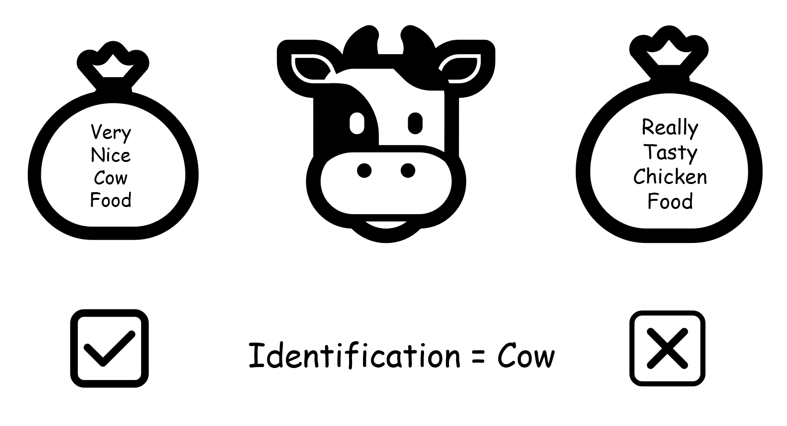
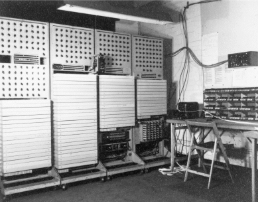
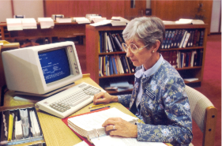

:::::::::::::::::::::::::::::::::::::: questions

* Why signature development?
* What is PRONOM?

::::::::::::::::::::::::::::::::::::::::::::::::

::::::::::::::::::::::::::::::::::::: objectives

* Understand why we care about signatures
* Gain an overview of PRONOM and its benefits.

::::::::::::::::::::::::::::::::::::::::::::::::

:::: instructor

* Welcome, housekeeping.
* Introduce the presenters.
* Brief intro for audience members e.g.
  * show of hands re interests
  * prior experience

> everyone will be interested in FFID to some extent.

::::

## Know what you’ve got (Why are we interested in identifying file formats?)

If you don't know what you have then how are you supposed to take care of it!

This applies to most caretaking roles, imagine you own a farm and you tried to feed the cows chicken food. You would not have a very successful farm.

<!--markdownlint-disable-->

{alt='a cow with a large bag of chicken feed'}

<!--markdownlint-enable-->

File formats, software and storage technologies develop at a frighteningly fast rate.

Computers have changed beyond recognition in a single working lifetime.

<!--markdownlint-disable-->

|   |   |
|---|---|
| {alt='the Colossus computer of the Second World War filling an entire room'}   <b>From a machine that covered an entire room...</b> | {alt='a librarian using a desktop IBM computer in 1987.'}   <b>To one that fits on your desk in less than forty years</b> |
| HW 225/26, Colossus computer WWII. Copyright The National Archives | A librarian at The National Library of Medicine using an IBM computer to access PDQ, 1987. Photo by National Cancer Institute on Unsplash |

<!--markdownlint-enable-->

 

* Knowing what you’ve got is a basic first step for managing digital
information - whether that’s records management, managing digital
continuity or Digital Preservation
* Our aim is to keep our digital information useful and usable.
* For ‘useful’ we usually think about managing the provenance and context of
digital information - where it came from, what it’s for, what it means…. This
work is often done by records managers or cataloguers.
* To keep digital information usable, we need to understand its technical
characteristics. Identifying file formats with confidence is a first step in
planning to keep those records usable - ensuring access to tools or services
that make the records possible to open, render or search in the future. This
is at the heart of digital preservation.
* This is detailed work. The precise format (e.g. what version of Word or PDF
do we have?) can be important.

## How can we identify file formats?

* There’s not one single method, but often there are a few clues

### The tools used to make it

* You may simply know what tools or software were used to create your
digital records (e.g. you know what camera was used by a project or what
word processor was available at the time). But usually we don’t know this
with any confidence, particularly if the records were created a long time
ago or came from outside the organisation.

### File extensions

* File extensions can be very helpful. But they can be changed and they
don’t usually tell us about specific versions.

### Looking inside the files

* To be more certain of a correct identification we need to look inside the digital files, at the precise sequence of
codes within the file. Sometimes the file format is stated within the file itself or will be part of a set of patterns point
us towards an identification. These patterns are known as file format
signatures. The starts and ends of files are good places to look for
these patterns.

## Analysing Files

* The encoding inside file formats can point us towards how they can be identified, by looking for reoccuring sequences or characteristic patterns. More often we will be looking for characteristic patterns that
* Some file formats have a formal specification - like a set of rules
detailing how these files should be constructed. Only files that conform
to the specification are ‘valid’ examples of that file format. If we have
access to the specification, it can help us with signature development.
The specification will define patterns that we can look for. But reality
is more complicated than this: the software products used to create the
files may not implement the specification correctly. We may see examples of
files that seem to work just fine (i.e. they can be opened, viewed, edited
using the relevant software) but if our identification relies on just the
rules in the specification, we won’t get a match. It can help us to know
whether or not a file is a valid example of the format - because invalid
files may be at greater risk of being unusable in the future, if a new
generation of the software is stricter.
* So, when creating signatures, we should review the specification if it’s
available. But we usually want to look beyond the specification. Ideally,
we should also look at examples of real files, from different sources if
possible.
* Because of this variation, file format research is both an art and a
science. Looking for patterns in files is a fairly structured activity.
Making a judgment about how strict to be or when to be flexible is more of
an art. If we make the signature too strict, we’ll fail to identify some
real examples. If we make it too flexible, we’ll generate false
identifications.

## PRONOM

PRONOM is a file format registry, a database of file format information. It has over 2000 different entries (that's over 2000 different file formats). Each entry includes identification charactersitics of the format which can include these internal characteristics and patterns found within the files.

* These file format signatures are useful to all of us. PRONOM is used within many file format identification tools such as DROID and Seigfried.
* PRONOM is used by people and also by software tools to help us identify the
file formats in our digital collections.

### A Short History of PRONOM

PRONOM is maintained and hosted by The National Archives, UK but is the result of over 20 years of research and contribution from 100s of individuals and institutions across the world. It is a free shared resource, created by the digital preservation community for the digital preservation community.

[insert picture of global map]

### Be Aware

* PRONOM is created by humans, and humans can make mistakes.
* PRONOM is not comprehensive, far from it. Although the most common file
formats are covered, at some point in your digital preservation work you
will encounter a file format that doesn’t have a signature in PRONOM. Or
you may find that a signature exists, but it doesn’t work well for the files
in your collection.

## Today

We will be embarking on researching and creating a new signature and then adding it to PRONOM!

<!-- NB. Keypoints should appear at the end of the markdown file. Aesthetically
     it looks like it's better with an additional newline so adding that
     here and using this comment as a separator to make it easy to read
     content.
-->

 

::::::::::::::::::::::::::::::::::::: keypoints

By the end of this workshop, you should be able to:

* Investigate a file format and find patterns
* Express patterns in PRONOM syntax
* Create a signature file
* Use your signature file locally
* Contribute signatures to PRONOM

 
It isn't just the beginning of your PRONOM journey, it's the beginning
of your digital forensics journey!

 

Enjoy!

::::::::::::::::::::::::::::::::::::::::::::::::
