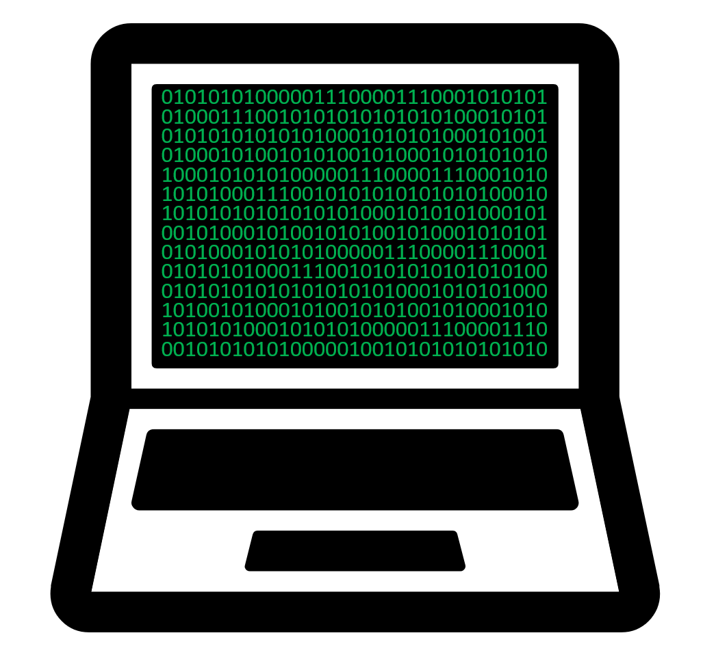
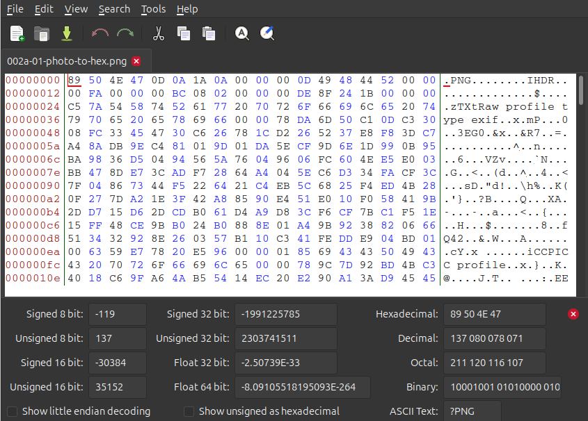
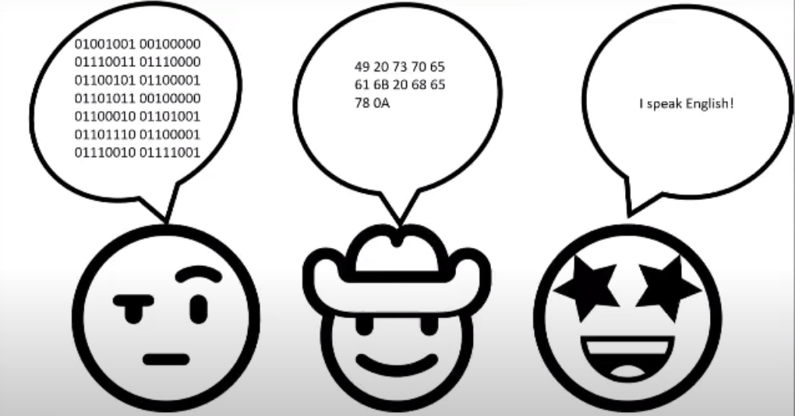

:::::::::::::::::::::::::::::::::::::: questions

* How do computers store information?
* Where does text come from, if computers only store numbers?
* What are encodings?

::::::::::::::::::::::::::::::::::::::::::::::::

::::::::::::::::::::::::::::::::::::: objectives

* Learn how computers store data, and how that data becomes something you
can read on your screen.
* See that binary, hexadecimal and text are three ways of writing the same
thing.

::::::::::::::::::::::::::::::::::::::::::::::::

:::: instructor

This is the high level overview, before anybody gets thrown into hex.
Hexadecimal turns up here as one of three ways of saying the same thing, and
that is all it needs to do. Conversion comes next, so if somebody asks, tell
them it is five minutes away.

::::

## How do we analyse file formats

To analyse a file we look at the hexadecimal of the file, there are a few reasons for this:
* It is easier to read than binary
* It doesn't vary in the way different encoding can

But what is binary, what is hexadecimal and what are encodings?

## Let's start at the beginning

Computers are built from billions of tiny electronic switches called transistors.

Like a light switch, each transistor has two possible states:

* On
* Off

 
 
To make these states easier to work with, we represent them as:

* On = 1
* Off = 0

These 1s and 0s are called **binary digits**, or **bits**. A single bit can only store one of two values: 0 or 1

These are usually what you can see when a spy is breaking into a computer in an action movie

<!--markdownlint-disable-->

{alt='a picture of a computer screen with lots of 0s and 1s on the screen'}

<!--markdownlint-enable-->

 

### What is behind your computer data?

* Computers combine the bits together, representing letters, numbers, images, sound, video, software and the information you see on a screen
* We call 8 of these bits grouped together a **byte**: 01001001
* This is the data that computers are interpreting
* Based on the order of the 0s and 1s in a byte they represent a single number
* There are 255 variations of 0s and 1s that can be stored in a byte
* 0 (b00000000) is the smallest number you can represent in binary in a single byte,
* 255 (b11111111) is the largest possible value.

 

<!--markdownlint-disable-->

<!--
-{alt='a photograph of a dog beside an arrow pointing to the same file opened in a hex editor, showing its contents as hexadecimal and decoded text.'}
-->

|   |   |   |
|---|:-:|---|
| {alt='a photograph of a dog'}  | {alt='image of a green arrow pointing leftwards.'} 
 |  {alt='the same image file of a dog opened in a hex editor, showing its contents as hexadecimal and decoded text.'}  |

<!--markdownlint-enable-->

The dog and the hex are the same file. One of them is what your software
renders for you. The other is what is actually sitting on the disk.
Everything we do from here happens on the right hand side.

 

:::: discussion

TODO...

::::

 

### Solving the communication barrier

* Computers combine the bits together, representing letters, numbers,
images, sound, video, software and the information you see on a screen.
* Computers ultimately store everything as binary
* Binary is difficult to read, so we convert the bytes into a numeric system called hexadecimal. We choose hexadecimal because there are more options than the decimal counting system we are used to.

## Why hexadecimal?

Although computers use binary, humans find long strings of 1s and 0s difficult to read.
For example:01001001
is not particularly memorable. Hexadecimal provides a shorter way of representing the same data.
The binary value: 01001001  can also be written as: 49

For example, the letter I:

| ASCII  | HEX   | Binary   |
|--------|-------|----------|
|   I    | 73    | 01001001 |

## Encodings

So if a byte is only ever a number, where does the letter `I` live?
It doesn't. Nothing in a byte is a letter. To store text on a computer we
use an encoding, and an encoding acts as a translation table between
characters and numbers. We agreed that 73 means `I`, and everything that
reads the file agrees too.

| Character | Decimal | Hexadecimal | Binary     |
| --------- | ------- | ----------- | ---------- |
| `I`       |   73	  | `49`        | `01001001` |

All four columns are saying the same thing.

The table we're using here is ASCII. It covers the English alphabet, the
digits, some punctuation and a handful of control codes, and that is all it
covers. In the olden days software developers only thought about English, so
that was fine. It was not fine for most of the planet.

## Where do you get 'ā', or '世'?

Today we have Unicode, and encodings like UTF-8 that store those
characters using more than one byte each. We'll see what that looks like in
the next episode.

:::: callout

## When the agreement breaks down

A file written with one encoding and read back with a different one is not
broken. Its bytes are fine. They are just being looked up in the wrong
table.
  
That is where `’` and `ä` come from, and why a name with a macron in it
can arrive in your catalogue looking like nonsense.

::::

 

<!--markdownlint-disable-->

{alt='three cartoon faces with speech bubbles: the first speaks a long string of binary digits, the second speaks pairs of hexadecimal numbers, the third says I speak English.'}

<!--markdownlint-enable-->

 

### Example Māori macrons in UTF-8

 

`0xC4 0x81` = ā

`0xC4 0x93` = ē

`0xC4 0xAB` = ī

`0xC5 0x8D` = ō

`0xC5 0xAB` = ū

`0xC4 0x80` = Ā

`0xC4 0x92` = Ē

`0xC4 0xAA` = Ī

`0xC5 0x8C` = Ō

`0xC5 0xAA` = Ū

 

### Hello World in Japanese in UTF-8

 

`0xE3 0x81 0x93` = こ

`0xE3 0x82 0x93` = ん

`0xE3 0x81 0xAB` = に

`0xE3 0x81 0xA1` = ち

`0xE3 0x81 0xAF` = は

`0xE4 0xB8 0x96` = 世

`0xE7 0x95 0x8C` = 界

<!-- NB. I found this site useful: https://www.compart.com/en/unicode/ for
     whatever reason it has a lot of info.
-->

 

::::::::::::::::::::::::::::::::::::: keypoints

* Computers store everything as bits: switches that are either on or off.
* 8 bits make a byte, and a byte holds one of 256 values.
* Binary, hexadecimal and encodings such as UTF-8 or ASCII are three ways of writing the same thing.
* Hexadecimal is the one we work with in file format analysis.

::::::::::::::::::::::::::::::::::::::::::::::::
