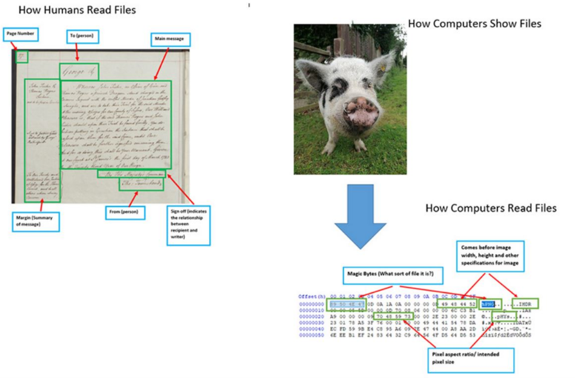
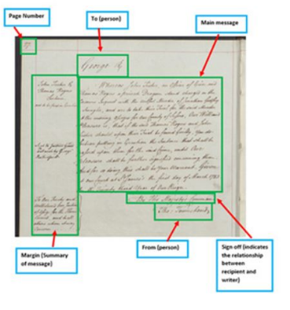
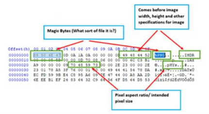

:::::::::::::::::::::::::::::::::::::: questions

* What is hexadecimal?
* What are the basics of hexadecimal?
* Why is hexadecimal important to look at files?

::::::::::::::::::::::::::::::::::::::::::::::::

::::::::::::::::::::::::::::::::::::: objectives

* Learn what hexadecimal is.
* Learn how to construct a hexadecimal sequence with arbitrary meaning.

::::::::::::::::::::::::::::::::::::::::::::::::

## Introduction to hexadecimal

* Hexadecimal is a way of representing numbers.
* Hexadecimal uses 16 symbols (0-9 and A-F) compared to the 10 symbols (0-9)
familiar in the decimal number system.
* Just as decimal is otherwerise known as Base10, hexadecimal is just Base16.

<!--markdownlint-disable-->

|      |      |      |      |      |      |      |      |      |      |      |      |      |      |      |      |      |
| ---- | ---- | ---- | ---- | ---- | ---- | ---- | ---- | ---- | ---- | ---- | ---- | ---- | ---- | ---- | ---- | ---- |
| DEC  | 0    | 1    | 2    | 3    | 4    | 5    | 6    | 7    | 8    | 9    | 10   | 11   | 12   | 13   | 14   | 15   |
| HEX  | 0    | 1    | 2    | 3    | 4    | 5    | 6    | 7    | 8    | 9    | A    | B    | C    | D    | E    | F    |
| DEC  | 16   | 17   | 18   | 19   | 20   | 21   | 22   | 23   | 24   | 25   | 26   | 27   | 28   | 29   | 30   | 31   |
| HEX  | 10   | 11   | 12   | 13   | 14   | 15   | 16   | 17   | 18   | 19   | 1A   | 1B   | 1C   | 1D   | 1E   | 1F   |

<!--markdownlint-enable-->

<br>

* While you can learn to convert decimal to hexadecimal, you are more likely
to convert hexadecimal to decimal when looking at file formats.

```text
0x00 = (16 x 0 = 0) + (1 x 0 = 1) = 0
0x01 = (16 x 0 = 0) + (1 x 1 = 1) = 1
0x0A = (16 x 0 = 0) + (1 x 10 = 10) = 10
0xFF = (16 x 15 = 240) + (1 x 15 = 15) = 255
```

<br>

:::: challenge

### Try it in your search engine

If you use a search engine, what results do you get for the following
queries?

* `0xFF in decimal`
* `42 in hexadecimal`
* `82 in binary`
* `0b1100 in decimal`

:::::: solution

### Search engines are your friend

Search engines can conveniently do the work of converting from decimal to
hexadecimal and back for you. You can also investigate binary numbers
quickly and easily this way without having to work out the layout of bits.

::::::

::::

:::: callout

### Zero to hero!

Zero is an important number in computer science and we will see it often
when we analyse digital records.

::::

:::: callout

### What does 0x mean?

We use the `0x` prefix to signify hexadecimal. When we document hex
sequences like above `0xE4 0xB8 0x96` is also equivalent to `0xE4B896`. How
you choose write this information depends on context.

You also saw `0b` as a prefix. This is used to denote binary (Base2),

e.g. `0b1100` equals `0x0C` equals `12`.

::::

* A pair of hexadecimal numbers is a convenient representation of 1-byte,
i.e. 8 bits of binary which is the smallest and most convenient unit of
data used in computer memory.

:::: callout

### Binary

* Binary uses 2 symbols, 0 and 1.
* Binary can otherwise be referred to as Base2.
We won’t explore binary in detail here, but if you ever want to look at the binary
representation of a number, modern search engines can do the conversion
for you if you ask: 255 in binary (just as you can ask: 255 in hexadecimal.


::::

### ASCII lookup table

* That might feel like a lot, but before we have to convert numbers every
which way, we have another tool at our disposal, a lookup table which is
still relevant in our research.

* In the lookup table below (the ASCII table) you can see how bytes take on
more meaning to a computer, e.g. as control symbols, punctuation symbols,
numbers, and letters.

* For the numbers and letters, this is just one encoding. We will talk about
the importance of that below but first let’s look at the table for a second.

:::: discussion

### question

When you look at the table, think about your favorite (decimal) number.

* What symbol does it represent?
* What’s your favourite (hexadecimal) number, what symbol does it represent?

::::

<br>

### ASCII table

| Dec | Hex | Char    | Dec | Hex | Char    | Dec | Hex | Char    | Dec | Hex | Char    | Dec | Hex | Char    |
|-----|-----|---------|-----|-----|---------|-----|-----|---------|-----|-----|---------|-----|-----|---------|
| 0   | 0   | NUL     | 25  | 19  | EM      | 51  | 33  | 3       | 77  | 4D  | M       | 103 | 67  | g       |
| 1   | 1   | SOH     | 26  | 1A  | SUB     | 52  | 34  | 4       | 78  | 4E  | N       | 104 | 68  | h       |
| 2   | 2   | STX     | 27  | 1B  | ESC     | 53  | 35  | 5       | 79  | 4F  | O       | 105 | 69  | i       |
| 3   | 3   | ETX     | 28  | 1C  | FS      | 54  | 36  | 6       | 80  | 50  | P       | 106 | 6A  | j       |
| 4   | 4   | EOT     | 29  | 1D  | GS      | 55  | 37  | 7       | 81  | 51  | Q       | 107 | 6B  | k       |
| 5   | 5   | ENQ     | 30  | 1E  | RS      | 56  | 38  | 8       | 82  | 52  | R       | 108 | 6C  | l       |
| 6   | 6   | ACK     | 31  | 1F  | US      | 57  | 39  | 9       | 83  | 53  | S       | 109 | 6D  | m       |
| 7   | 7   | BEL     | 32  | 20  | space   | 58  | 3A  | :       | 84  | 54  | T       | 110 | 6E  | n       |
| 8   | 8   | BS      | 33  | 21  | !       | 59  | 3B  | ;       | 85  | 55  | U       | 111 | 6F  | o       |
| 9   | 9   | HT      | 34  | 22  | "       | 60  | 3C  | <       | 86  | 56  | V       | 112 | 70  | p       |
| 10  | 0A  | LF      | 35  | 23  | #       | 61  | 3D  | =       | 87  | 57  | W       | 113 | 71  | q       |
| 11  | 0B  | VT      | 36  | 24  | $       | 62  | 3E  | >       | 88  | 58  | X       | 114 | 72  | r       |
| 12  | 0C  | FF      | 37  | 25  | %       | 63  | 3F  | ?       | 89  | 59  | Y       | 115 | 73  | s       |
| 13  | 0D  | CR      | 38  | 26  | &       | 64  | 40  | @       | 90  | 5A  | Z       | 116 | 74  | t       |
| 14  | 0E  | SO      | 39  | 27  |         | 65  | 41  | A       | 91  | 5B  | [       | 117 | 75  | u       |
| 15  | 0F  | SI      | 40  | 28  | (       | 66  | 42  | B       | 92  | 5C  | \       | 118 | 76  | v       |
| 16  | 10  | DLE     | 41  | 29  | )       | 67  | 43  | C       | 93  | 5D  | ]       | 119 | 77  | w       |
| 17  | 11  | DC1     | 42  | 2A  | *       | 68  | 44  | D       | 94  | 5E  | ^       | 120 | 78  | x       |
| 18  | 12  | DC2     | 43  | 2B  | +       | 69  | 45  | E       | 95  | 5F  | _       | 121 | 79  | y       |
| 19  | 13  | DC3     | 44  | 2C  | ,       | 70  | 46  | F       | 96  | 60  | `       | 122 | 7A  | z       |
| 20  | 14  | DC4     | 45  | 2D  | -       | 71  | 47  | G       | 97  | 61  | a       | 123 | 7B  | {       |
| 21  | 15  | NAK     | 46  | 2E  | .       | 72  | 48  | H       | 98  | 62  | b       | 124 | 7C  | |       |
| 22  | 16  | SYN     | 47  | 2F  | /       | 73  | 49  | I       | 99  | 63  | c       | 125 | 7D  | }       |
| 23  | 17  | ETB     | 48  | 30  | 0       | 74  | 4A  | J       | 100 | 64  | d       | 126 | 7E  | ~       |
| 24  | 18  | CAN     | 49  | 31  | 1       | 75  | 4B  | K       | 101 | 65  | e       | 127 | 7F  | DEL     |
|     |     |         | 50  | 32  |         | 76  | 4C  | L       | 102 | 66  | f       |     |     |         |

<!-- created with https://ozh.github.io/ascii-tables/
     and https://www.rapidtables.com/code/text/ascii-table.html
-->

## Magic Numbers

To do file format research we look at the structure of the files in hex

* Files have reoccurring byte patterns within them that show us what they are
* Computers read bytes to render on your screen in a similar way to how we might read a letter. A pre-known structure that helps disseminate the information.

<!--markdownlint-disable-->

<!--
{alt='on the left, a handwritten letter annotated to show the page number, addressee, main message, sender and sign-off; on the right, a photograph of a pig alongside the same file shown as hexadecimal, annotated to show the magic bytes, the image header and the pixel specifications.'}
-->

<br>

|     |
| :-: |
| {alt='a handwritten letter annotated to show the page number, addressee, main message, sender and sign-off'} |
| How humans read a file |

<br>

|     |     |     |
| --- | :-: | --- |
| {alt='a photograph of a pig, showing its contents as hexadecimal and decoded text.'} | {alt='image of a blue arrow pointing rightwards'} | {alt='the same image file of a pig shown as hexadecimal, annotated to show the magic bytes, the image header and the pixel specifications'} |
| How computers read a file |    |

<!--markdownlint-enable-->


## Famous Byte sequences

* `D0CF11E0`
* `II`
* `MM`
* `GIF89a`
* `PK`
These are all 'Magic Numbers' - sequences that the format developers have
chosen for quick identification of their file formats.

:::: instructor

### Optional quiz

You can ask the room if they know what these byte sequences might be.

::::

:::: spoiler

### Do you recognize them?

* Microsoft Office
* TIFF
* Also TIFF!
* GIF
* ZIP

::::

:::: callout

### Magic numbers: your first file format signatures

You will begin to recognize these sequences in your file format research!

::::

## Putting it together

Can you use the ASCII table above to construct a byte-sequence?

:::: challenge

Write down the hexadecimal sequence for "Hello world".

:::::: solution

```binary
48 65 6C 6C 6F 20 77 6F 72 6C 64
```

::::::

::::

<!-- NB. Keypoints should appear at the end of the markdown file. Aesthetically
     it looks like it's better with an additional newline so adding that
     here and using this comment as a separator to make it easy to read
     content.
-->

<br>

::::::::::::::::::::::::::::::::::::: keypoints

* Hexadecimal is a number system.
* Hexadecimal makes it easier to understand “binary”.
* Hexadecimal is mapped to signals and characters that have meaning to
a computer.
* Hexadecimal can take on arbitrary meaning through “encodings”.
* Hexadecimal is the foundation for a PRONOM signature!

::::::::::::::::::::::::::::::::::::::::::::::::
