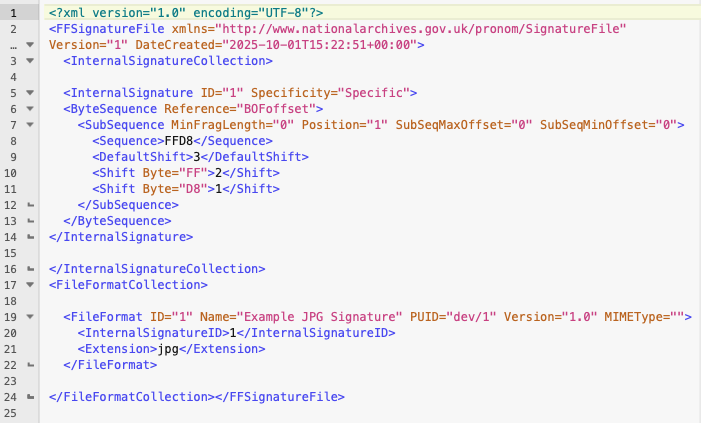
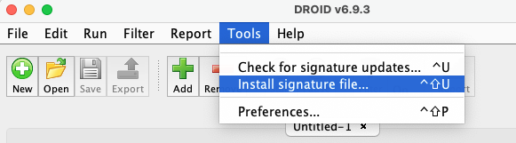

:::::::::::::::::::::::::::::::::::::: questions

- What’s a signature file?
- How do we create one?

::::::::::::::::::::::::::::::::::::::::::::::::

::::::::::::::::::::::::::::::::::::: objectives

- Create a signature file.
- Investigate the internals of a signature file.

::::::::::::::::::::::::::::::::::::::::::::::::

## Making it work with DROID and Siegfried

You now have a sequence you think will work with your format and
understand the syntax needed. How do we get that sequence into something
DROID or Sigfried can use?

## What is a signature file?

A signature file is a representation of the byte sequence, written in a
way tools like DROID or Siegfried can use to match the byte sequence within
a file or group of files. This pattern is written to an XML structure which
records the sequence, offsets, and descriptive information about the file.

{alt='image shows the XML used to define a signature file used by DROID. It contains a lot of information used by previous DROIDs to optimize pattern matching.'}

A Signature file consists of two parts, the byte signature and the file
format information. The signature will have an ID which is then referenced
in the file format information tag, connecting the two.

This file can be created from scratch using any text editor, but nobody
wants to do that, let’s look at the
[amazing tool Ross Spencer wrote](https://ffdev.info/) to help with
signature creation.

{alt='image shows the user interface of the signature development utility.'}

## Signature development utility

The signature development utility will take the sequence you want
to use and generate the XML needed by tools like DROID to use. Use a name
which is specific to the format. If you know the version of the format the
sequence describes, you can add it as well, but if you are unsure, leave
it blank. The form has a place for the extension, and if there is more
than one, we can add that later in the XML directly. Many formats have a
mime-type, some official, others not so official, add the type here if
it is commonly used.
  
Add your sequence and anchor it at the beginning of the file or end
of file, then add any offsets if needed. You can always add additional
sequences to add more accuracy to the signature.
  
Pressing the “Create Signature” button will generate an XML file
based on your information and immediately download to your computer.
This can then be moved to your .droid6 folder or imported in the
DROID Application.

{alt='image shows DROID user interface and where you would navigate to so that you can upload a new signature file.'}

<!-- NB. Keypoints should appear at the end of the markdown file. Aesthetically
     it looks like it's better with an additional newline so adding that
     here and using this comment as a separator to make it easy to read
     content.
-->

 

::::::::::::::::::::::::::::::::::::: keypoints

- A signature file is a set of instructions for DROID.
- You can create signature files using the Signature Development Utility.
- A signature file is separated into sections.
- One section is used for metadata about identification results.
- Another section is used to store the instructions for identification.

::::::::::::::::::::::::::::::::::::::::::::::::
