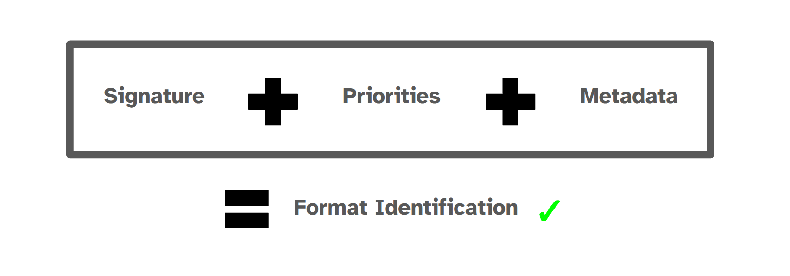

:::::::::::::::::::::::::::::::::::::: questions

- What's left to learn?
- What other considerations are there when documenting file format signatures?

::::::::::::::::::::::::::::::::::::::::::::::::

::::::::::::::::::::::::::::::::::::: objectives

- Identify new learning objectives.

::::::::::::::::::::::::::::::::::::::::::::::::

## Priorities

Signatures will also makes use of a priority over another file format
which allows tools using PRONOM to enforce a single identification for a
file, e.g. Scalabale Vector Graphics (SVG) (a format based on XML) has
a priority over XML to prevent SVG being identified as XML when it can be
identified more specifically.

To that end, you will often see priorities over core file formats such as
HTML, PDF, JPEG, TIFF, OLE2, and so on, as many other file format variants
will be written on top of those.

## The complete picture

When you've completed your efforts a complete PRONOM record is a combination
of signature & priorities & metadata.

<!-- markdownlint-disable -->

{alt='Image shows how a format identification is constructed in PRONOM by combining signature, priority, and metadta'}

<!-- markdownlint-emable -->

When you submit a new sigature to PRONOM you get a good feel for the
information they are looking for when you do.

:::: callout

### Information to submit to PRONOM

* Format name
* Version number
* Extensions
* MIME/Media Type
* Description
* Format type
* Vendor
* File format identification signatures
* Relevant links, documentation, extra information
* Credit

::::

## Container signatures

Many of the techniques used for standard signatures and signature development
can be applied to container files. Container files are formats built on top
of technologies such as ZIP and OLE2 whose contents can be queried to
provide more accurate identification.

Container signatures take some additional effort to research and test. We
will endeavor to follow up this learning resource with a similar one
containing all of the information from our previous workshop:
_**PRONOM: What's in the Box?**_

* [More information from that workshop][box-1].

[box-1]: https://linktr.ee/pronom.whats.in.the.box

## Recording your progress

The [PRONOM Research](https://github.com/digital-preservation/PRONOM_Research)
repository is a great place to have discussions about file forrmats you are
working on, as well as request new entries or updated ones.

Some researchers, such as Tyler, maintain their own GitHub repositories for
file format research. This is useful as it provides them with a way to:

* record inforamation,
* store sample signature files,
* store sample files.

It provides something to point to, and a way to keep track of your own efforts.

 

:::: callout

### FAQ and Glossary

Consult the [FAQ](../learners/faq.md) section of this site for
quick answers to some of the questions you may have going forward.

We also hope the [glossary](../learners/reference.md) will be useful
in contunuing to demystify some of the terminology you will have
come across today.

::::

<!-- TODO: new byteseek format... -->

<!-- NB. Keypoints should appear at the end of the markdown file. Aesthetically
     it looks like it's better with an additional newline so adding that
     here and using this comment as a separator to make it easy to read
     content.
-->

 

::::::::::::::::::::::::::::::::::::: keypoints

- Much of this effort is researching files and writing a signature but
another big part is testing, calibration, AND documentation.

::::::::::::::::::::::::::::::::::::::::::::::::
