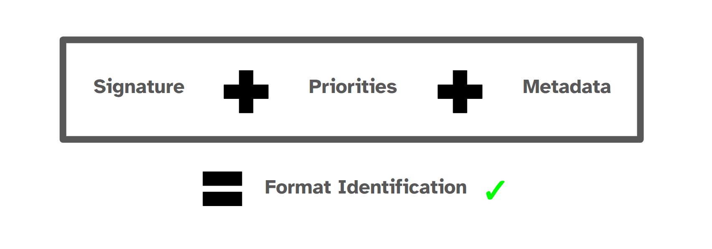

:::::::::::::::::::::::::::::::::::::: questions

- What's left to learn?
- What other considerations are there when documenting file format signatures?

::::::::::::::::::::::::::::::::::::::::::::::::

::::::::::::::::::::::::::::::::::::: objectives

- Identify new learning objectives.

::::::::::::::::::::::::::::::::::::::::::::::::

## Priorities

Signatures will also makes use of a priority over another file format
which allows tools using PRONOM to enforce a single identification for a
file, e.g. Scalabale Vector Graphics (SVG) (a format based on XML) has
a priority over XML to prevent SVG being identified as XML when it can be
identified more specifically.

To that end, you will often see priorities over core file formats such as
HTML, PDF, JPEG, TIFF, OLE2, and so on, as many other file format variants
will be written on top of those.

## The complete picture

When you've completed your efforts, a complete PRONOM record is a combination
of signature & priorities & descriptive information (metadata) about the file format.

<!-- markdownlint-disable -->

{alt='Image shows how a format identification is constructed in PRONOM by combining signature, priority, and metadta'}

<!-- markdownlint-emable -->

When you submit a new signature to PRONOM, you will get feel for the
information they are looking for. The PRONOM team will help you.

:::: callout

### Information to submit to PRONOM

* Format name
* Version number
* Extensions
* MIME/Media Type
* Description
* Format type
* Vendor
* File format identification signatures
* Relevant links, documentation, extra information
* Credit

Of these, Format name is absolutely mandatory and the rest are nice to have,
but the more information you can provide, the better! If you've created any file format signatures
it will be useful to describe your thought process and links to any relevant documentation, such
as format specifications.

::::

## Container signatures

Many of the techniques used for standard signatures and signature development
can be applied to container files. Container files are formats built on top
of technologies such as ZIP and OLE2 whose contents can be queried to
provide more accurate identification.

Container signatures take some additional effort to research and test. We
will endeavor to follow up this learning resource with a similar one
containing all of the information from our previous workshop:
_**PRONOM: What's in the Box?**_

* [More information from that workshop][box-1].

[box-1]: https://linktr.ee/pronom.whats.in.the.box

## Recording your progress

The [PRONOM Research](https://github.com/digital-preservation/PRONOM_Research)
repository is a great place to have discussions about file forrmats you are
working on, as well as request new entries or updated ones.

Some researchers, such as Tyler, maintain their own GitHub repositories for
file format research. This is useful as it provides them with a way to:

* record information,
* store sample signature files,
* store sample files.

It provides something to point to, and a way to keep track of your own efforts.

## Just Solve It: File Formats, and COPTR

Two complementary resources to this work are the Just Solve It wiki by
Archive Team:

* [Just Solve It: File Formats][JSI-1]

[JSI-1]: http://fileformats.archiveteam.org/wiki/Main_Page

And COPTR (Community-Owned digital Preservation Tool Registry) by the
Open Preservation Foundation:

* [COPTR](https://coptr.digipres.org/Main_Page)

As you research your file formats, you might find more information about them
that doesn't sit easily on the PRONOM website. The community can benefit
from this information as well.

### Just Solve It: File Formats

The Just Solve It wiki primarily captures information about file formats.

Information you might record here are other details about them, including:

* links to specifications,
* links to more sample files,
* links to Wikidata records,
* software,
* and so on...

### COPTR

COPTR on the other hand records information about software that can help
us preserve different aspects of files and file formats.

If there are software packages connected to your format that also
serve some sort of preservation purpose, e.g. provide metadata extract, then
you might want to add these to COPTR's wiki as well.

 

:::: testimonial

One way that both the <b>Just Solve It</b> and <b>COPTR</b> wikis benefit
the community is that they are easily editable and can help us maximize the
information we collect about our respective preservation challenges. They
allow the community to benefit from this knowledge immediately while the
PRONOM team takes the time to test and verify signature-related information
and add those resources to PRONOM. They can also help us to record details
early on while we still don't have a PRONOM signature ready to submit.

::::

 

:::: callout

### FAQ and Glossary

Consult the [FAQ](../learners/faq.md) section of this site for
quick answers to some of the questions you may have going forward.

We also hope the [glossary](../learners/reference.md) will be useful
in contunuing to demystify some of the terminology you will have
come across today.

::::

<!-- TODO: new byteseek format... -->

<!-- NB. Keypoints should appear at the end of the markdown file. Aesthetically
     it looks like it's better with an additional newline so adding that
     here and using this comment as a separator to make it easy to read
     content.
-->

 

::::::::::::::::::::::::::::::::::::: keypoints

- Much of this effort is researching files and writing a signature, but
another big part is testing, calibration, AND documentation.
- The Just Solve It and COPTR wikis are complimentary resources that can
be used as landing zones as we collect information early on about file format
signatures or as we develop them.
- The FAQ and Glossary are available for quick reference whenever you need
them in your signature development journey.

::::::::::::::::::::::::::::::::::::::::::::::::
