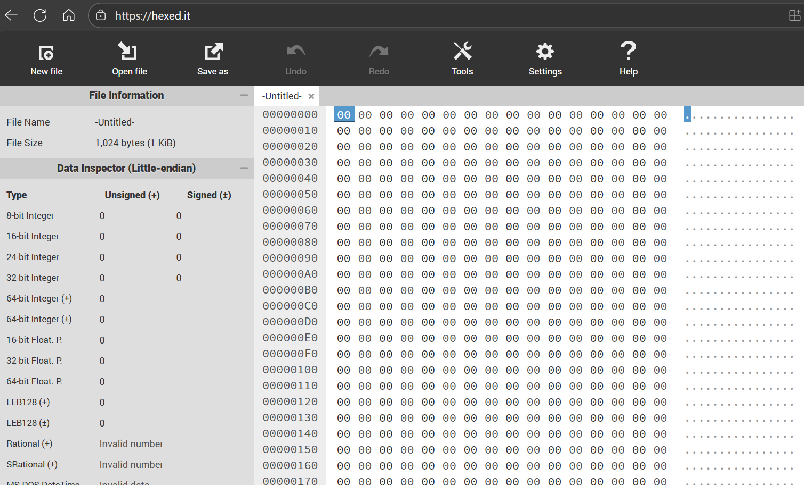
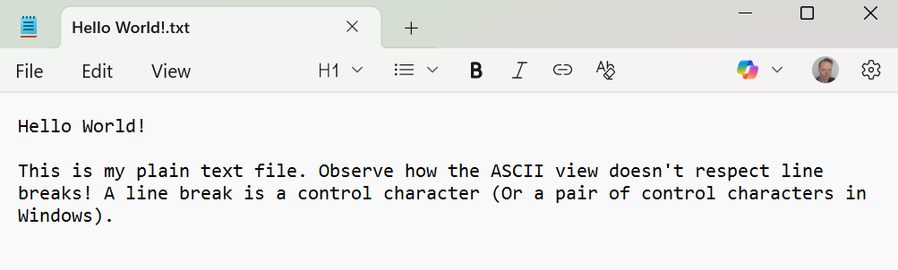
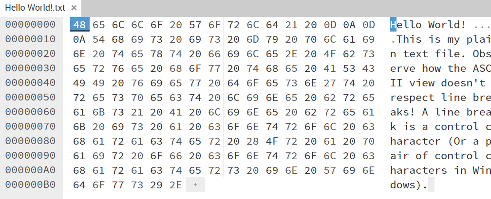
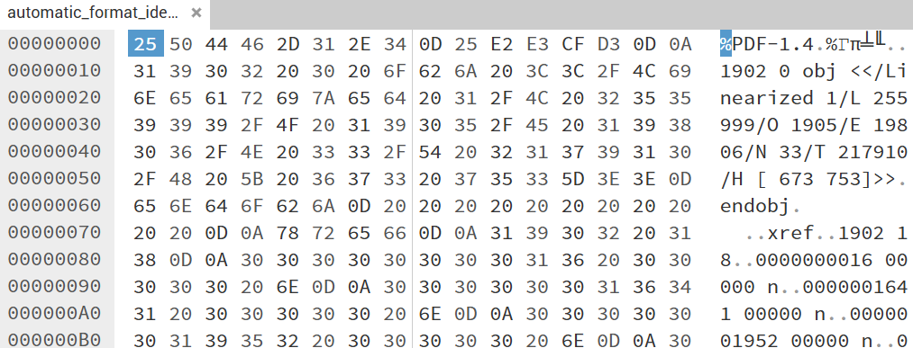

:::::::::::::::::::::::::::::::::::::: questions

* Introducing the Hex Editor
* What is a Hex Editor?
* Why use a Hex Editor?
* How do I understand the layout
* How can I keep my data safe when using a hex editor
* How do I use a Hex Editor?
* Can I use a hex editor now?

::::::::::::::::::::::::::::::::::::::::::::::::

::::::::::::::::::::::::::::::::::::: objectives

* Get everybody onto a Hex Editor
* Understand how they work
* Understand what they’re used for
* Understand what I’m seeing
* Highlight and reinforce good, safe practice
* Hands-on demo
* Reinforce by doing

::::::::::::::::::::::::::::::::::::::::::::::::

## Introducing HexEd.it

HexEd.it is a web-brased hex-editor and should prove incredibly useful in
your future signature development adventures!

* Find it at: [HexEd.it](https://HexEd.it)

<!--markdownlint-disable-->

{alt='image shows a screenshot of the https://hexed.it user interface in the web browser.'}

<!--markdownlint-enable-->

:::: instructor

Make a note to participants that keeping a separate HexEd.it tab open will
be beneficial throughout the remainder of this workshop.

::::

## What is a Hex Editor?

* Bytecode representation of digital file
* Typically displays Hexadecimal, and ASCII/ANSI representations of data
* Enables direct editing of data values

## Why use a Hex Editor?

* File forensics
* Reverse engineering
* **Understanding file formats at a low-level**
* Cheating in video games\!

## How do I understand the layout?

* Offset values show the position of data within the file
* Offsets also use hexadecimal notation, and start at offset 0 (or 0x00)
* The byte at Offset 0x00 is the first byte; Offset 0x0A is the 11th byte;
Offset 0x4000 is the 16,385th byte\!
* Hexadecimal view shows binary data represented as bytes (8 bits per byte)
* ASCII view shows text interpretation of data
* Text on ASCII side may appear ‘scrambled’ \- this suggests binary encoded
data
* Some Hex Editors (like this one) can suggest different interpretations of
blocks of data
* Some Hex Editors allow for text interpretations (character sets) other
than ASCII, such as EBCDIC

 

:::: caution

### Safety first!

* A Hex Editor allows for the direct manipulation of data within digital
files (note, this isn’t really any different from Notepad in this regard)
* Possible to make mistakes and accidentally save over your data
* Therefore: Always work on a copy of your data, never the original data

::::

## Using the Hex Editor

### Demoing ‘Hello World!’ text file

<!--markdownlint-disable-->

{alt='image shows our plain\-text file as it would be viewed in a standard text editor, e.g. MS Notepad.'}

{alt='image shows the hexadecimal representation of a plain\-text file in a hex editor\'s user interface.'}

<!--markdownlint-enable-->

:::: callout

#### Sample file

You can take the sample file and view it in the hex editor for yourself.

* [Hello World!.txt](./files/Hello%20World!.txt)
(MD5: <code>44d63b2ec6c79739ce994597e1d66d84</code>)

::::

### Demoing PDF

<!--markdownlint-disable-->

{alt='image shows the hexadecimal representation of a PDF file in a hex editor\'s user interface.'}

<!--markdownlint-enable-->

:::: challenge

### Your turn

* Drag a file of your choosing into your Hex Editor
* Tell us what you’ve observed!

::::

<!--

Files used in this section:

* automatic\_format\_identification.pdf
* Hello World\!.txt

-->

<!-- NB. Keypoints should appear at the end of the markdown file. Aesthetically
     it looks like it's better with an additional newline so adding that
     here and using this comment as a separator to make it easy to read
     content.
-->

 

::::::::::::::::::::::::::::::::::::: keypoints

* Recommend HexEd.it as an online tool for the session. Mention HxD, others
* ‘Bytecode’ representation of file - both Hexadecimal and ‘ASCII’,
with 0x00-1F control characters usually represented as periods (dots)
or spaces
* File Forensics, reverse engineering, understanding file formats at a
low-level. My first exposure to Hex Editors was editing the save files of
video games to give me extra lives or gold!
* Understanding offsets, Hex-view, limitations of ASCII view
* Encourage ‘Safety First’ - it’s called an ‘editor’ for a reason, so to
avoid the risk of corrupting your own originals, always work with a copy of
your original files
* Drag a Plain text file everybody has access to to demonstrate ASCII
representation. Drag a further file (PDF?) to demonstrate mixture of binary
and ASCII data- with reference to PRONOM, highlight magic number,
reinforcement of offset meaning. Demonstrate how easy it is to change
data, to reinforce safety first aspects!
* Drag a file of your choosing into the hex editor - raise your hand if
you’d like to share any observations

::::::::::::::::::::::::::::::::::::::::::::::::
