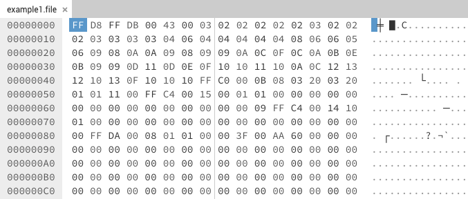
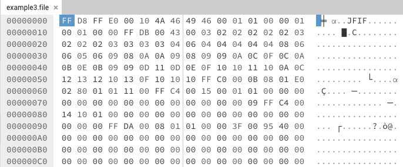
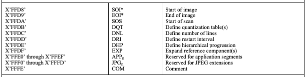

:::::::::::::::::::::::::::::::::::::: questions

* Do my samples have the same “magic” numbers?
* What version do these files represent?
* Do I need more samples to draw conclusions?
* Do I have access to a format specification?

::::::::::::::::::::::::::::::::::::::::::::::::

::::::::::::::::::::::::::::::::::::: objectives

* Recognize patterns in sample files.
* Have more confidence in deciding which values to use in a signature.
* Read a format specification and draw conclusions.

::::::::::::::::::::::::::::::::::::::::::::::::

## Exploring file types

With a hex editor you can now explore all file types regardless of format.
This comes in handy when exploring files which don’t seem to be identify
with existing tools. You can quickly open the file to view the hex byte
sequences and start to understand the format of the file.
  
Opening a single file in a hex editor can be illuminating or seem like
you just entered the Matrix.

<!--markdownlint-disable-->

{alt='image shows the hexadecimal representation of a JPEG file in a hex editor\'s user interface.'}

<!--markdownlint-enable-->

In this example we don’t really know much about the file as the
extension is not known and there is no human readable text to help. So by
itself this file is hard to identify.

## Searching for the bytes

We can take some of the byte sequences and use search engines to try and
find references to the sequences as one solution or if you have additional
files with the same extension you can use them to compare.

## Comparing samples

<!--markdownlint-disable-->

{alt='image shows the hexadecimal representation of another JPEG file in a hex editor allowing us to identify differences in patterns.'}

<!--markdownlint-enable-->

With a second file we can start to see differences and similarities
between them. The most noticeable is the first two bytes “FF D8”. This
second example also has a bit of human readable text which can also help
in identification. The more samples you have the more confident you can be
in choosing a byte sequence to use for a signature.
  
You may find patterns that work with some of your samples but not with
others, Choosing a byte sequence too short may clash with other file formats,
but sequences too long may be too strict. Your sample files may represent
files saved with different versions of the same software which can alter
their structure. This can be helpful if you want to identify a file down to
the version of the software which created it.

## Creating samples

Being able to create sample files using original software or finding
samples specific to a certain version of software is a big help in
determining identification. Look for tutorials, sample files on installer
disks, or create your own using trial versions of the software.

## Referencing the specification

Having a file format specification can be the most helpful in
understanding a file format, but isn’t always available. In the case of the
example files above, we can see in the
[T.81 specification for compressed images][tiff-1],
the “FF D8” sequence is used as the start of image bytes for a JPEG file.
The specification also gives us what should be at the end of the
file as well, “FF D9”.

[tiff-1]: https://www.w3.org/Graphics/JPEG/itu-t81.pdf#page=36

<!--markdownlint-disable-->

<!--
{alt='image shows the descriptions given to different markers in the JPEG specification. These act like keys we can use to make file format signatures consistent.'}
-->

<!--markdownlint-enable-->

|  |  |  |
| --- | --- | --- |
| 0xFFD8 | SOI | Start of image |
| 0xFFD9 | EOI | End of image |
| 0xFFDA | SOS | Start of scan |
| 0xFFDB | DQT | Define quantization table(s) |
| 0xFFDC | DNL | Define number of lines |
| 0xFFDD | DRI | Define restart interval |
| 0xFFDE | DHP | Define hierarchical progression |
| 0xFFDF | EXP | Expand reference component(s) |
| 0xFFE0 through 0xFFEF | APP | Reserved for application segments |
| 0xFFF0 through 0xFFFD | JPG | Reserved for JPEG extensions |
| 0xFFFE | COM | Comment |

## 0xFFD9

As you progress further into this research, you will want to find sample
files. There may be some samples known to you. Finding samples from
heterogeneous sources can help to remove biases in signatures and ensure
that your work is globally applicable and not just local.

:::: callout

## Resources for finding Sample files

Tyler has developed a resource for helping to find sample files for format
identification research.

* [Resources for finding Sample files](https://github.com/thorsted/fileformat).

::::

<!-- NB. Keypoints should appear at the end of the markdown file. Aesthetically
     it looks like it's better with an additional newline so adding that
     here and using this comment as a separator to make it easy to read
     content.
-->

 

::::::::::::::::::::::::::::::::::::: keypoints

* The more samples from different versions of the format can ensure better
identification.
* Not all formats have available specifications
* The more variations in samples, patterns emerge.

::::::::::::::::::::::::::::::::::::::::::::::::
